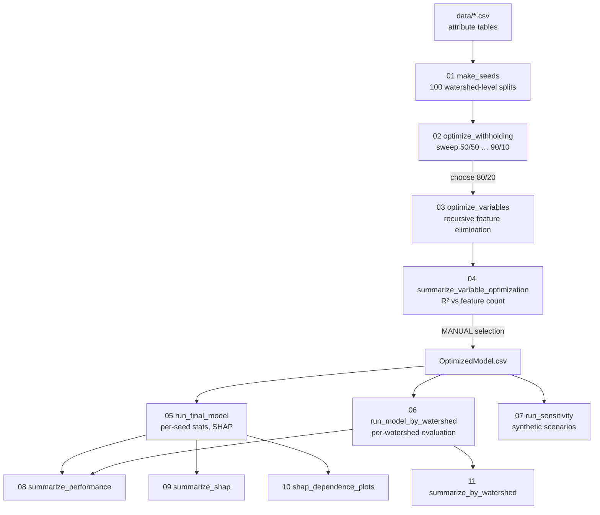

# Post-Fire Peak Flow Random Forest Pipeline — Complete Explainer

A step-by-step walkthrough of every script in this repository: what it does, how it does it,
and the mathematics behind each choice. Written as a reference for understanding the method
and as source material for a public README.

---

## Table of contents

1. [What the pipeline is trying to do](#1-what-the-pipeline-is-trying-to-do)
2. [The data model](#2-the-data-model)
3. [Five methodological choices that shape everything](#3-five-methodological-choices-that-shape-everything)
4. [The mathematics of the shared machinery (`rf_utils.py`)](#4-the-mathematics-of-the-shared-machinery-rf_utilspy)
5. [Pipeline overview](#5-pipeline-overview)
6. [Step-by-step walkthrough](#6-step-by-step-walkthrough)
7. [Output tree](#7-output-tree)
8. [Reproducibility notes](#8-reproducibility-notes)
9. [Known gaps and caveats](#9-known-gaps-and-caveats)
10. [Glossary](#10-glossary)

---

## 1. What the pipeline is trying to do

**The scientific question.** After a wildfire, watersheds respond to rainfall very differently
than they did before. Hydrophobic soils, lost canopy interception, and lost surface roughness
all push more rain into the channel, faster. The practical question is: *given what we know
about a burned watershed and an incoming storm, how big will the peak flow be — and which
characteristics drive that answer?*

**The modeling formulation.** This is a supervised regression problem. Each row of the training
data is one **storm event at one watershed**. The target is the storm's peak flow, normalized by
basin area:

$$\text{PeakArea} = \frac{Q_{\text{peak}}}{A_{\text{basin}}} \quad \left[\frac{\text{m}^3/\text{s}}{\text{km}^2}\right]$$

Area-normalizing is what makes a 60 km² basin and a 900 km² basin comparable — without it, basin
size would dominate every model and swamp the fire and storm signals we actually care about.

The predictors are ~15–60 columns describing the watershed (physiography, soils, climate), the
fire (extent, severity, time since burn), the storm (intensity, duration, antecedent wetness),
and — critically — the *interaction* between fire and storm (what fraction of the storm fell on
the burned area, and how intense that portion was).

**Why a random forest.** The relationships here are non-linear and full of interactions. Burned
area matters much more when the storm actually lands on the burn scar; time since fire matters
differently depending on severity. Random forests capture that kind of structure without anyone
having to specify a functional form. They handle mixed-scale predictors without standardization,
they don't extrapolate wildly, and — importantly for a paper about *drivers* — they support
principled attribution through SHAP.

**Why interpretation is the point.** The deliverable is not a forecasting tool. It's an argument
about which post-fire flood drivers matter and how. That's why over half the pipeline
(steps 08–11) is devoted to summarizing and interpreting a model that was already trained in
step 05.

---

## 2. The data model

### 2.1 The attribute tables

Four CSVs ship in `data/`. Each row is one watershed–storm pair.

| File | Role |
|---|---|
| `RF_AttributeTable_PeakMag_FullDataset.csv` | Everything collected (~60 columns) |
| `RF_AttributeTable_PeakMag_FullDataste_trimmed.csv` | Correlated features removed — **the starting set for optimization** |
| `RF_AttributeTable_PeakMag_OptimizedModel.csv` | Final selected feature set (16 features) — **the table the final model uses** |
| `RF_AttributeTable_Sensitivity_9361000.csv` | A single watershed's baseline attributes, for step 07 |

Note the typo `FullDataste` — it exists in the data as shipped, and the code references it as-is.

> **These are examples, not the full training data.** They illustrate the *format* and let the
> pipeline run. Running this code does not reproduce the published numbers.

### 2.2 Column roles

Every script partitions the columns the same way:

```python
features = [c for c in data.columns if c not in (METRIC, ID_COL)]
```

- **`PeakArea`** — the target (`METRIC`). Never a feature.
- **`GAGE_ID`** — the USGS gage identifier (`ID_COL`). Never a feature. It is the *grouping key*
  for splitting (see §3.2), which is the only reason it's carried through the pipeline at all.
- **Everything else** — a feature.

This "everything that isn't the target or the ID is a feature" convention means **feature
selection is done by choosing which table to load**, not by editing code. That's why step 04's
output is a new CSV rather than a config change.

### 2.3 Feature families

The 16 columns in the optimized table group naturally into four families. This grouping is what
step 09 uses to color its importance bars.

**Storm and antecedent conditions** — what the weather did.
`AntecedentPrecip_mm` (how wet the basin already was), `AvgMonthly_Precip_cm`, `D1`, `CoefVar`.

**Fire characteristics** — what burned, how badly, how long ago.
`DaysSinceFire`, `MTBS_burnedarea_per` (% of basin burned per MTBS), 
`SBS_mod_high_area_burned_per_wat` (% burned at moderate-to-high soil burn severity),
`ratio_LAI` (leaf area index change, a vegetation-loss proxy).

**Burned–storm interaction** — the fire/storm coupling, and conceptually the most important
family in this problem. `burned_storm_depth_per` and `burned_storm_int_per` are *percentiles*
describing how much of the storm's depth and intensity fell on burned ground. A large fire and a
large storm only produce a large post-fire peak if they overlap in space.

**Watershed physiography and long-term climate** — the static basin properties.
`DRAIN_SQKM`, `riparian_area_per`, `PPTAVG_BASIN`, `RH_BASIN`, `SNOW_PCT_PRECIP`,
`PRECIP_SEAS_IND`.

> `D1` and `CoefVar` are not documented in the project's data dictionary. In the full dataset they
> sit between `DaysSinceFire` and `RainedPercent`, i.e. inside the storm block, which is why
> step 09 categorizes them as storm variables — but that placement is an inference from column
> order, not a confirmed definition. **Confirm both against the manuscript before publishing.**

---

## 3. Five methodological choices that shape everything

These five decisions recur in nearly every script. Understanding them makes the rest of the code
read as obvious.

### 3.1 The target is log-transformed

Every model in this pipeline fits $\log(\text{PeakArea})$, not $\text{PeakArea}$:

```python
y_train = np.log(train[METRIC])
```

**Why.** Peak flows span orders of magnitude — a small event might be 0.001 m³/s/km² and a large
one 1.0. Random forests minimize squared error:

$$\mathcal{L} = \sum_i (y_i - \hat{y}_i)^2$$

On the raw scale, a 10% error on a large peak contributes vastly more loss than a 100% error on a
small one. The model would spend all its capacity on the largest events and effectively ignore
the rest of the distribution. Log-transforming converts *multiplicative* error into *additive*
error, so a factor-of-two miss costs the same everywhere in the range:

$$\log(2y) - \log(y) = \log 2 \quad \text{regardless of } y$$

This also matches how hydrologists actually think about flood magnitude — in factors and orders
of magnitude, not absolute differences.

**The retransformation subtlety — important.** Predictions come back in log space and get
exponentiated for plotting:

```python
preds[f"pred_seed_{x}"] = np.exp(model.predict(X_scen))
```

For a random variable $Z \sim \mathcal{N}(\mu, \sigma^2)$:

$$\mathbb{E}[e^Z] = e^{\mu + \sigma^2/2} \neq e^{\mathbb{E}[Z]} = e^{\mu}$$

So $\exp(\hat{y})$ estimates the conditional **median** (equivalently the geometric mean), *not*
the conditional mean, of PeakArea. It is systematically **low** as an estimate of the mean, by
roughly a factor of $e^{\sigma^2/2}$. This pipeline applies no smearing or bias correction.

That's a defensible choice — the median is often what you want for a skewed flood distribution —
but it must be stated. If a reviewer asks "are these predicted *mean* peak flows?", the answer is
no.

**Consequence for metrics.** Because `evaluate()` is called on log-space values, every R², MSE,
and RMSE in this pipeline describes **log peak flow**. An RMSE of 1.1 is 1.1 *log units*, i.e. a
typical multiplicative error of $e^{1.1} \approx 3\times$. Never report these as if they were
m³/s/km².

### 3.2 Splits are at the watershed level, not the row level

```python
train_ids = pd.read_csv(split_dir / "wats_train.csv")[ID_COL].tolist()
train = data[data[ID_COL].isin(train_ids)]
```

Splitting is by **`GAGE_ID`**, so every storm at a given gage lands on the same side of the split.

**Why this matters enormously.** Many features are *constant within a watershed* — `DRAIN_SQKM`,
`PPTAVG_BASIN`, `SNOW_PCT_PRECIP`, soils, physiography. If you split randomly by row, storms from
the same gage appear in both train and test. The forest can then memorize "basins with
DRAIN_SQKM = 347.8 and RH_BASIN = 61.6 tend to peak around 0.04" — effectively learning a lookup
table keyed on the watershed's fingerprint. Test performance would look excellent and mean
nothing.

Grouping by gage forces the test watersheds to be **entirely unseen**. The reported R² therefore
measures *spatial transferability*: can this model predict a watershed it has never encountered?
That is a much harder and much more honest question, and it's why the R² values here (~0.3–0.5)
are lower than a naive row-split would produce.

### 3.3 Randomness lives in the split, not in the forest

Every model is built with:

```python
RF_KWARGS = dict(n_estimators=100, random_state=42)
```

`random_state=42` is fixed **everywhere**. Given identical training data, the forest is
deterministic. All the variability in this pipeline comes from the 100 different train/test
splits ("seeds") generated in step 01.

This is a deliberate separation of concerns. Each seed answers "what if I'd held out a different
set of watersheds?" — which is the uncertainty that actually matters for a study with a limited
number of gages. Across 100 seeds you get a *distribution* of R² and a *distribution* of SHAP
values, and the spread tells you how much your conclusions depend on which watersheds happened to
be in your sample.

> **Terminology warning:** "seed" in this codebase means *a train/test split*, indexed
> `Seed_0 … Seed_99`. It does **not** mean a random number generator seed. The RNG seed is fixed.

### 3.4 The model has a stated domain of applicability

Four bounds are applied before training:

```python
BOUNDS = dict(min_drain_sqkm = 50, min_burned_storm_depth_per = 70,
              max_days_since_fire = 1095, min_mtbs_burnedarea_per = 20)
```

| Bound | Meaning |
|---|---|
| `DRAIN_SQKM ≥ 50` | Basin at least 50 km² |
| `MTBS_burnedarea_per ≥ 20` | At least 20% of the basin burned |
| `burned_storm_depth_per ≥ 70` | Storm concentrated on the burned area (≥70th percentile) |
| `DaysSinceFire ≤ 1095` | Within 3 years of the fire |

These are not tuning knobs. They define the population the model is claimed to describe: *large
basins, substantially burned, hit by a storm that actually landed on the burn scar, within three
years of the fire.* Predictions outside this envelope are extrapolation and shouldn't be trusted.

Filtering *before* training also concentrates the model's capacity on the regime of interest
rather than diluting it with events where the fire is irrelevant.

### 3.5 Interpretation is pooled across seeds

No single model's SHAP values are trusted. Steps 09–11 concatenate SHAP output from all 100 seeds
before summarizing. A feature that looks important in one split but not others gets averaged down;
a feature that's consistently important survives. This is the interpretive analogue of reporting
a confidence interval instead of a point estimate.

---

## 4. The mathematics of the shared machinery (`rf_utils.py`)

`rf_utils.py` holds the mechanical operations repeated across steps 02, 03, 05, 06, 07, 09, 10,
and 11. It is deliberately thin — model fitting, scoring, ranking, computing SHAP, reloading saved
SHAP, and two diagnostic plots. Nothing scientific is hidden in here.

### 4.1 Fitting — `fit_rf`

```python
def fit_rf(X_train, y_train, **kwargs):
    model = RandomForestRegressor(**kwargs)
    model.fit(X_train, y_train)
    return model
```

**How a random forest regressor works.**

*Step 1 — Bootstrap.* For each of $B = 100$ trees, draw $n$ samples **with replacement** from the
$n$ training rows. Each tree sees a different resample; roughly 63.2% of unique rows appear in any
given bootstrap ($1 - e^{-1} \approx 0.632$), and the rest are "out of bag."

*Step 2 — Grow a regression tree.* At each node, search over candidate (feature $j$, threshold
$t$) pairs and pick the split that most reduces squared-error impurity. For node $m$ holding
sample set $S_m$:

$$H(S_m) = \frac{1}{|S_m|} \sum_{i \in S_m} (y_i - \bar{y}_m)^2, \qquad \bar{y}_m = \frac{1}{|S_m|}\sum_{i \in S_m} y_i$$

The chosen split maximizes the weighted impurity decrease:

$$\Delta(m, j, t) = H(S_m) - \frac{|S_L|}{|S_m|}H(S_L) - \frac{|S_R|}{|S_m|}H(S_R)$$

where $S_L = \{i \in S_m : x_{ij} \leq t\}$ and $S_R = S_m \setminus S_L$. This is exactly
minimizing the within-child variance — each split tries to make the two resulting groups as
internally homogeneous in peak flow as possible.

With scikit-learn defaults (`max_depth=None`, `min_samples_leaf=1`), trees grow until leaves are
pure or unsplittable. Individual trees are therefore heavily overfit; the ensemble average is what
generalizes.

*Step 3 — Predict.* A leaf predicts the mean $y$ of its training samples. The forest averages:

$$\hat{f}(x) = \frac{1}{B}\sum_{b=1}^{B} T_b(x)$$

Averaging $B$ noisy, roughly-decorrelated estimators shrinks variance by up to a factor of $B$
while leaving bias roughly unchanged — the entire reason bagging works.

> **A detail worth knowing about this configuration.** In scikit-learn ≥ 1.1,
> `RandomForestRegressor` defaults to `max_features=1.0`, meaning **every feature is considered at
> every split**. The "random subspace" half of the classic Random Forest algorithm is therefore
> *not active* here — the only randomization is bootstrap resampling. Trees end up more correlated
> than in a canonical random forest, which slightly reduces the variance benefit of averaging.
> This is scikit-learn's default and matches the original author's configuration, so it is
> reported here as-is, not as a defect. If you ever want the canonical behavior, that's
> `max_features="sqrt"` or `max_features=1/3`.

### 4.2 Scoring — `evaluate`

```python
def evaluate(y_true, y_pred):
    mse = mean_squared_error(y_true, y_pred)
    return {"mse": mse, "rmse": np.sqrt(mse), "R2": r2_score(y_true, y_pred)}
```

$$\text{MSE} = \frac{1}{n}\sum_{i=1}^{n}(y_i - \hat{y}_i)^2, \qquad \text{RMSE} = \sqrt{\text{MSE}}$$

$$R^2 = 1 - \frac{\sum_i (y_i - \hat{y}_i)^2}{\sum_i (y_i - \bar{y})^2} = 1 - \frac{SS_{\text{res}}}{SS_{\text{tot}}}$$

Three things to be precise about:

1. **All three are in log units** (§3.1). RMSE is a multiplicative error factor after
   exponentiation.
2. **$\bar{y}$ is the mean of the *test* set**, not the training set. $R^2$ compares the model
   against "always predict the test set's own mean" — a benchmark that requires information the
   model doesn't have.
3. **$R^2$ can be negative.** If the model does worse than predicting the test mean,
   $SS_{\text{res}} > SS_{\text{tot}}$. With small test sets (step 06 evaluates *one watershed*),
   negative values are common and not a bug.

### 4.3 Feature importance — `ranked_importances`

```python
def ranked_importances(model, feature_names) -> pd.DataFrame:
    return (pd.DataFrame({"Feature": list(feature_names),
                          "Importance": model.feature_importances_})
            .sort_values("Importance", ascending=False)
            .reset_index(drop=True))
```

`feature_importances_` is **Mean Decrease in Impurity (MDI)**, also called Gini importance. For
feature $j$:

$$\text{Imp}(j) = \frac{1}{B}\sum_{b=1}^{B} \; \sum_{\substack{m \in \text{nodes}(T_b) \\ \text{split on } j}} \frac{|S_m|}{n} \, \Delta(m)$$

Every time a tree splits on feature $j$, credit the impurity reduction achieved, weighted by how
many samples reached that node. Sum over all nodes and trees, average, normalize to sum to 1.

**MDI has two well-known biases**, both directly relevant here:

- **It favors high-cardinality features.** Continuous variables offer many candidate thresholds
  and can reduce impurity partly by chance. Binary or low-cardinality features are
  systematically disadvantaged.
- **It splits credit arbitrarily among correlated features.** If two features carry nearly the
  same information, trees use them interchangeably and each receives roughly half the importance —
  making both look unimportant.

The pipeline addresses both: correlated features are removed *before* modeling (that's what the
`_trimmed` table is), and final interpretation uses SHAP, not MDI. MDI is used for the *recursive
elimination* in step 03 — where it's a reasonable and cheap heuristic for "which feature to drop
next" — but never for the paper's importance claims.

### 4.4 SHAP — `compute_shap` and `shap_frames`

```python
def compute_shap(model, X):
    explainer = shap.TreeExplainer(model)
    return explainer(X)

def shap_frames(shap_values):
    values = pd.DataFrame(shap_values.values, columns=shap_values.feature_names)
    data = pd.DataFrame(shap_values.data, columns=shap_values.feature_names)
    return values, data
```

**The idea.** SHAP answers, for *one specific prediction*: how much did each feature push this
prediction above or below the average prediction?

SHAP values are **Shapley values** from cooperative game theory. Treat the features as players
cooperating to produce the prediction, and fairly divide the "payout" (the difference between this
prediction and the baseline). The Shapley value for feature $j$ at input $x$:

$$\phi_j(x) = \sum_{S \subseteq N \setminus \{j\}} \frac{|S|!\,(|N| - |S| - 1)!}{|N|!}\Big[f_x(S \cup \{j\}) - f_x(S)\Big]$$

where $N$ is the set of all features, $S$ is a subset not containing $j$, and $f_x(S)$ is the
model's expected output when only the features in $S$ are known. In words: **average the marginal
contribution of feature $j$ over every possible ordering in which features could be revealed.**
The combinatorial weight makes each ordering equally likely.

Shapley values are the *unique* attribution satisfying local accuracy, missingness, and
consistency. The property that matters most in practice is **local accuracy (additivity)**:

$$f(x) = \phi_0 + \sum_{j=1}^{|N|} \phi_j(x), \qquad \phi_0 = \mathbb{E}[f(X)]$$

Every prediction decomposes *exactly* into a base value plus one contribution per feature. Nothing
is unexplained.

**Two things to keep straight:**

- **SHAP values are in the model's output units — here, log(m³/s/km²).** A SHAP value of $+0.4$
  for `burned_storm_depth_per` means that feature pushed the log peak up by 0.4, i.e. multiplied
  the predicted peak by $e^{0.4} \approx 1.5$. They are *not* percentages and *not* m³/s/km².
- **They are signed and local.** Positive means "pushed this prediction up." The same feature can
  push up for one storm and down for another — which is exactly what step 10 visualizes.

**Why `TreeExplainer` specifically.** The sum above is over $2^{|N|}$ subsets — computationally
hopeless in general. **TreeSHAP** exploits tree structure to compute *exact* Shapley values in
$O(TLD^2)$ time ($T$ trees, $L$ leaves, $D$ depth) instead of exponential. This is what makes SHAP
tractable for a 100-tree forest and why SHAP, not permutation importance, is the interpretation
tool here. It is still the slowest part of the pipeline.

`shap_frames` splits the returned object into two aligned tables — **`values`** (the $\phi_{ij}$)
and **`data`** (the feature values $x_{ij}$ that produced them). Row $i$, column $j$ of one
corresponds exactly to row $i$, column $j$ of the other. Step 10 needs both: it plots feature
value on the x-axis against SHAP value on the y-axis.

### 4.5 Reloading saved SHAP — `seed_shap_frames` and `load_pooled_shap`

Steps 09, 10, and 11 all re-read the SHAP tables that steps 05 and 06 wrote to disk. Two helpers
cover every case:

```python
seed_shap_frames(run_dir, n_seeds, leaf="", with_data=False)   # list, one entry per seed
load_pooled_shap(run_dir, n_seeds, leaf="", with_data=False)   # the same, concatenated
```

`leaf` is the per-seed subfolder, which is what lets step 11 reach into the by-watershed run
(`leaf="Watershed_USGS9361000"`) with the same code path steps 09 and 10 use on `model_run/`.
Seeds with no SHAP output are skipped rather than raising, so a partial run still summarizes.

The split between the two matters statistically. `load_pooled_shap` concatenates with
`ignore_index=True`, giving every *storm* equal weight — right for steps 09 and 10, which describe
the dataset. Step 11 instead uses `seed_shap_frames` to average *within* each seed first and then
across seeds, giving every *seed* equal weight regardless of how many storms it scored — right
when comparing watersheds whose event counts differ.

### 4.6 Diagnostic plots

`plot_predicted_vs_actual` scatters observed against predicted with a 1:1 reference line, with an
optional `back_transform=True` to exponentiate first. `plot_residuals` scatters predicted against
residual $r_i = y_i - \hat{y}_i$ with a zero line — used to check for heteroscedasticity or
systematic bias. Residuals are left in log space, where the model's error structure is
approximately symmetric.

---

## 5. Pipeline overview



**Three phases.** Steps 01–04 are *design*: they decide how to split the data and which features
to keep. Steps 05–07 are *execution*: they train the final models and generate raw output. Steps
08–11 are *interpretation*: they turn per-seed output into the figures and tables that make the
paper's argument.

**The pipeline is not fully automatic.** Step 04 → step 05 has a human in the loop (§6.4).

---

## 6. Step-by-step walkthrough

### 6.1 — `01_make_seeds.py` — Build the train/test splits

**Purpose.** Generate 100 reusable watershed-level train/test splits, so every downstream step
evaluates against the same 100 configurations.

**The math.** Let $W$ be the set of unique gage IDs. For a withholding fraction $p$:

$$n_{\text{test}} = \lfloor |W| \cdot p \rfloor$$

For each seed $x \in \{0, \dots, 99\}$, draw $T_x \subset W$ uniformly at random **without
replacement**, $|T_x| = n_{\text{test}}$, and set $R_x = W \setminus T_x$.

```python
n_test = int(len(watersheds) * WITHHOLD_FRACTION)
test = random.sample(watersheds, n_test)
train = [w for w in watersheds if w not in test]
```

Note this operates on the **unique gage list**, not on rows. A watershed with 40 storms and one
with 3 storms are equally likely to be held out — the split is balanced by *watershed*, not by
*event count*. A consequence is that test-set row counts vary noticeably between seeds (in a
sample run, 425 to 548 storms), because which watersheds you draw determines how many events come
with them.

**Configuration.** Change `WITHHOLD_FRACTION` and re-run, once per withholding percentage you
want to compare in step 02. The output folder label is *derived* from the fraction:

```python
WITHHOLDING = f"{round((1 - WITHHOLD_FRACTION) * 100)}_{round(WITHHOLD_FRACTION * 100)}"
```

so `0.2 → "80_20"` and the two can never disagree. Downstream scripts (02, 03, 05, 06, 07) keep
`WITHHOLDING` as a literal string, which is correct — they are *readers* pointing at a folder
that already exists.

**Reproducibility.** `RANDOM_SEED = None` by default, which means **splits differ on every run**.
See §8 — this is the single most important reproducibility control in the repo.

**Output.** `outputs/seeds/<WITHHOLDING>/Seed_<x>/{wats_train.csv, wats_test.csv}` — each just a
one-column list of `GAGE_ID`.

---

### 6.2 — `02_optimize_withholding.py` — Choose the train/test ratio

**Purpose.** Answer an empirical question: how much data should be held out? Withhold too little
and the test set is too small to measure anything stably; withhold too much and the model is
starved of training data.

**How.** For each withholding ratio in `['50_50', '60_40', '70_30', '80_20', '90_10']`, and for
each of 100 seeds: apply the domain bounds, train a forest, score it on the held-out watersheds,
record R². Then compare the distribution of R² across ratios.

```python
df = df[(df.DRAIN_SQKM >= BOUNDS["min_drain_sqkm"]) &
        (df.MTBS_burnedarea_per >= BOUNDS["min_mtbs_burnedarea_per"]) &
        (df.burned_storm_depth_per >= BOUNDS["min_burned_storm_depth_per"]) &
        (df.DaysSinceFire <= BOUNDS["max_days_since_fire"])]
```

The bounds are applied **once, to the whole table, before splitting** — so train and test are both
restricted to the domain of applicability. This is correct: the filter is part of the problem
definition, not a modeling decision, so it cannot leak information.

```python
model = fit_rf(train[features], np.log(train[METRIC]), **RF_KWARGS)
stats = evaluate(np.log(test[METRIC]), model.predict(test[features]))
```

**Reads the trimmed table**, not the optimized one — this step runs *before* feature selection, so
it must use the full candidate feature set.

**Interpretation.** The output is one CSV per ratio with R² per seed. You compare the *central
tendency and spread*: the best ratio has a high median R² without excessive variance. This is what
justified 80/20 for this project. Because each ratio is evaluated over the same 100-seed protocol,
the comparison is apples-to-apples.

**Output.** `outputs/withholding_optimization/withholding_<ratio>.csv`.

---

### 6.3 — `03_optimize_variables.py` — Recursive feature elimination

**Purpose.** Determine how model performance changes as features are removed, and produce a
defensible ranking of feature importance.

**The algorithm.** For each seed, starting from the full trimmed feature set $F_0$:

1. Train a forest on the current feature set $F_k$.
2. Record R², MSE, RMSE and the full importance ranking at $|F_k|$ features.
3. Identify the least important feature $j^* = \arg\min_{j \in F_k} \text{Imp}(j)$.
4. Set $F_{k+1} = F_k \setminus \{j^*\}$.
5. Repeat until one feature remains.

```python
while len(features) >= 1:
    n = len(features)
    ...
    model  = fit_rf(X_train, y_train, **RF_KWARGS)
    stats  = evaluate(y_test, model.predict(X_test))
    ranked = ranked_importances(model, features)

    pd.DataFrame([stats]).to_csv(out_dir / f"Stats_Vars{n}.csv", index=False)
    ranked.to_csv(out_dir / f"Importances_Vars{n}.csv", index=False)

    features = [f for f in features if f != ranked["Feature"].iloc[-1]]
```

Since `ranked` is sorted descending, `.iloc[-1]` is the least important feature — the one dropped.

**Why *recursive* rather than one-shot.** You could rank all features once and take the top $k$.
That's worse, because importance is *conditional on the feature set*. Two features sharing
information each look mediocre while both are present; remove one and the other's importance
jumps. Re-ranking after every removal lets the model re-express itself, so surviving features
reflect what's genuinely irreplaceable.

**Cost.** With $|F_0| \approx 44$ features and 100 seeds, this is ~4,400 forest fits. The
docstring's warning is not an exaggeration — this is the slowest step in the pipeline after SHAP.

**Output.** `outputs/variable_optimization/Seed_<x>/Stats_Vars<n>.csv` and
`Importances_Vars<n>.csv` — one pair per feature count per seed.

---

### 6.4 — `04_summarize_variable_optimization.py` — Aggregate the elimination curves

**Purpose.** Turn step 03's thousands of small CSVs into (a) an R²-versus-feature-count curve
averaged over seeds, and (b) an average importance ranking at each feature count.

**Discovery, not assumption.** Seed folders are found by globbing `Seed_*` (sorted by the trailing
integer, so `Seed_10` doesn't land before `Seed_2`), and the available feature counts are read off
the `Stats_Vars<n>.csv` filenames. Nothing is hard-coded, so this works for any starting feature
count.

**The R² curve.** For each seed, assemble $(n, R^2_n)$ pairs across all feature counts, sort by
$n$, and plot. Then average across seeds:

$$\bar{R}^2_n = \frac{1}{|\text{seeds}|}\sum_{s} R^2_{n,s}$$

The resulting curve typically rises steeply as the first few features are added, plateaus, and may
decline slightly at high $n$ as noise features dilute the signal. **The plateau's left edge is the
target** — the smallest feature count that retains essentially all the performance.

**The rank aggregation.** For a given feature count $n$, read each seed's `Importances_Vars<n>.csv`,
take each feature's row position as its rank, and average across seeds:

$$\bar{r}_j = \frac{1}{|\text{seeds}|}\sum_{s} r_{j,s}$$

Features absent from a seed's list (already eliminated) receive a penalty rank of
$|\text{features}| + 1$, so consistently-eliminated features sort to the bottom. Lower average
rank = more important.

**This step ends in a manual decision.** The author read the R² curve, chose a feature count, and
then *hand-adjusted* the selection — deliberately retaining certain burn variables on domain
grounds even where the ranking alone wouldn't have kept them. The result was saved as
`RF_AttributeTable_PeakMag_OptimizedModel.csv`.

This is worth stating plainly in the paper rather than presenting selection as purely automatic.
It's a legitimate choice — a variable that is scientifically central to a post-fire flood study
belongs in the model even if MDI ranks it mid-pack — but it is a judgment call, and it is the
reason the pipeline cannot be run end-to-end without a human.

The script prints where mean R² peaks as a convenience, with the reminder that the peak is *not*
the answer — you want the left edge of the plateau, which is a judgment about the curve's shape.

**Output.** `outputs/variable_optimization_summary/` — `r2_by_feature_count.csv` (feature count ×
seed), `r2_mean.csv`, `r2_curve.png`, and `rankings/average_rank_vars<n>.csv` per feature count.

---

### 6.5 — `05_run_final_model.py` — Train the final models

**Purpose.** The centerpiece. Train one forest per seed on the optimized feature set and emit
everything the interpretation steps need.

**Per seed:**

```python
train_ids = pd.read_csv(split_dir / "wats_train.csv")[ID_COL].tolist()
test_ids  = pd.read_csv(split_dir / "wats_test.csv")[ID_COL].tolist()

train = data[data[ID_COL].isin(train_ids)]
test  = data[data[ID_COL].isin(test_ids)]

y_train = np.log(train[METRIC])
y_test  = np.log(test[METRIC])
model   = fit_rf(train[features], y_train, **RF_KWARGS)
y_pred  = model.predict(test[features])
```

Then five outputs:

| File | Contents |
|---|---|
| `stats.csv` | mse, rmse, R2 (log space) |
| `predictions.csv` | `GAGE_ID, y_test, y_pred` — log space, gage attached |
| `importances.csv` | Feature, Importance (MDI), sorted |
| `shap_values.csv` / `shap_data.csv` | $\phi_{ij}$ and the $x_{ij}$ that produced them |
| `predicted_vs_actual.png`, `residuals.png` | Diagnostics |

**Why `GAGE_ID` travels with the predictions.** Steps 08 and 11 need to group results by
watershed. Carrying the key forward means they never have to re-derive which watershed a row came
from — the split files stay the single source of truth.

**Why predictions stay in log space on disk.** Log space is the model's native space, so it's what
diagnostics and metrics should use. Exponentiating is a *presentation* choice, deferred to
whichever downstream step is drawing a figure. Writing raw and letting consumers transform avoids
baking a lossy convention into the stored data.

**`DROP_COLUMNS`.** A list of columns to exclude even if present, with `errors="ignore"` so the
same config works across attribute tables that don't all carry the same columns.

**Cost.** SHAP dominates. Model fitting is seconds per seed; TreeSHAP over a few hundred test rows
is substantially longer, and it runs 100 times.

---

### 6.6 — `06_run_model_by_watershed.py` — Per-watershed evaluation

**Purpose.** Step 05 reports one R² for a seed's entire test set — a pooled number across ~30
watersheds. This step instead evaluates **each test watershed individually**, so you can ask which
watersheds the model handles well and which it fails on, and what drives predictions *at a
specific gage*.

**Structure — one fit per seed.** Within a seed, the training set is identical no matter which
test watershed you are scoring: `train_ids` doesn't change in the inner loop. So the forest is fit
**once per seed** and then applied to each test watershed in turn:

```python
train = data[data[ID_COL].isin(train_ids)]
model = fit_rf(train[features], np.log(train[METRIC]), **RF_KWARGS)   # once
ranked_importances(model, features).to_csv(seed_dir / "importances.csv", index=False)

for watershed in test_ids:
    test = data[data[ID_COL] == watershed]
    ...
```

The original refit an identical model (same data, same `random_state=42`) for every test
watershed — roughly 30 redundant fits per seed. Predictions are bit-for-bit unchanged; it is
simply ~30× less work. For the same reason, **feature importances are written once per seed**
rather than duplicated into every watershed folder: they describe the model, and the model is
shared.

**Why per-watershed R² behaves differently.** With one watershed's handful of storms,
$SS_{\text{tot}} = \sum(y_i - \bar{y})^2$ is computed over very few points with little spread.
Negative R² is common and expected here — it means the model did worse than predicting that
watershed's own mean, which is a low bar the model never had access to. Read these numbers as
*relative* comparisons between watersheds, not as absolute skill.

**Watersheds with a single storm produce `R² = NaN`**, and scikit-learn emits
`UndefinedMetricWarning: R^2 score is not well-defined with less than two samples`. With one
point, $SS_{\text{tot}} = 0$ and the ratio is undefined. This is expected, not a failure — but it
means downstream means over per-watershed R² will skip those gages, so a watershed's R² being
absent from a summary is not the same as it being poor.

**SHAP note.** TreeSHAP is computed per row, so a watershed's SHAP values here are identical to
the rows step 05 already produced for the same seed — just sliced by gage. In principle this whole
step is derivable from step 05's outputs by grouping on `GAGE_ID`; the only thing preventing it is
that step 05's `shap_values.csv` doesn't carry the gage ID. Worth revisiting if runtime becomes a
problem, since it would not change any result.

---

### 6.7 — `07_run_sensitivity.py` — Synthetic scenario analysis

**Purpose.** For one watershed of interest, ask a counterfactual: *if this driver were different,
and everything else stayed the same, what would the peak be?*

**Scenario construction.**

```python
def build_sensitivity_set(baseline):
    blocks = [baseline.assign(swept_variable="baseline", swept_value=np.nan)]
    for feature, values in SWEEPS.items():
        for _, base in baseline.iterrows():
            block = pd.concat([base.to_frame().T] * len(values), ignore_index=True)
            block[feature] = values
            block["swept_variable"] = feature
            block["swept_value"] = values
            blocks.append(block)
    return pd.concat(blocks, ignore_index=True)
```

Start from the real attribute values of watershed 9361000. For each driver in `SWEEPS`, replicate
the baseline row once per sweep value and overwrite *only that column*. With $B$ baseline rows and
sweep lengths summing to 51, the result is $B \times (1 + 51) = 52B$ scenarios. The
`swept_variable` / `swept_value` columns tag each row so the output can be grouped per driver.

**Prediction across the model ensemble.**

```python
train_ids = [w for w in train_ids if w != WATERSHED]
train = data[data[ID_COL].isin(train_ids)]
model = fit_rf(train[features], np.log(train[METRIC]), **RF_KWARGS)
preds[f"pred_seed_{x}"] = np.exp(model.predict(X_scen))
```

The watershed of interest is **explicitly removed from training** in every seed, so all
predictions are genuinely out-of-sample. Predictions are exponentiated back to m³/s/km² —
appropriate here, because the output is meant to be read as a physical flow magnitude.

**Summarizing the ensemble.**

$$\bar{y}_s = \frac{1}{100}\sum_{x=1}^{100} \hat{y}_{s,x}, \qquad q_{05}, q_{95} = \text{5th/95th percentile across seeds}$$

The percentile band is the useful part: it shows how much the answer depends on *which model* you
ask, i.e. on which watersheds happened to be in the training set. A driver whose sweep produces a
clear trend that survives the band is a robust finding; one buried inside the band is not.

**Relationship to ICE plots.** A conventional Individual Conditional Expectation plot fixes the
model and sweeps the instance. This fixes the *instance* (one watershed) and sweeps both the
feature and **the model**. So the spread you see is model/sampling uncertainty, not instance
heterogeneity.

**The standard caveat, which applies fully here.** Varying one feature while holding others fixed
generates combinations that may not exist in nature. Setting `MTBS_burnedarea_per = 100` while
leaving `SBS_mod_high_area_burned_per_wat` at its baseline describes a basin that burned entirely
but only lightly — possible, but far from the training data. Random forests don't extrapolate;
they return the average of the nearest training leaves, so predictions in sparse regions flatten
out and are unreliable. Read the sweeps as *within-support sensitivity*, not as forecasts for
extreme values.

**Output.** `outputs/sensitivity/sensitivity_predictions_USGS<WATERSHED>.csv` — every scenario with
its baseline attributes, sweep tags, ensemble summary, and all 100 individual predictions.

---

### 6.8 — `08_summarize_performance.py` — Pooled performance figure

**Purpose.** The paper's main performance figure: predicted versus actual across every seed, with
selected watersheds highlighted.

**Part 1 — the density cloud.** Pooling 100 seeds produces tens of thousands of points, and a
plain scatter is a solid blob. So the point density is estimated and used as the color channel.

**Gaussian kernel density estimation.** For points $\mathbf{x}_1, \dots, \mathbf{x}_n \in
\mathbb{R}^2$ (here, log actual and log predicted):

$$\hat{f}(\mathbf{x}) = \frac{1}{n}\sum_{i=1}^{n} K_{\mathbf{H}}(\mathbf{x} - \mathbf{x}_i), \qquad K_{\mathbf{H}}(\mathbf{u}) = \frac{1}{2\pi|\mathbf{H}|^{1/2}}\exp\left(-\tfrac{1}{2}\mathbf{u}^\top \mathbf{H}^{-1}\mathbf{u}\right)$$

Place a smooth Gaussian bump on every observation and sum. `scipy.stats.gaussian_kde` selects the
bandwidth by Scott's rule, $n^{-1/(d+4)}$, scaled by the data covariance.

```python
points  = np.vstack([predictions.y_test, predictions.y_pred])
shading = gaussian_kde(points)(points)
```

Density is estimated **in log space** — where the model was fit and where points are evenly spread
— then the coordinates are exponentiated for plotting on log-log axes. Estimating density on the
raw scale would be dominated by the crowded small-peak end.

Note this is $O(n^2)$: every point is evaluated against every kernel. It is the slow line in this
script.

**Part 2 — per-watershed box plots.** For each highlighted watershed, step 06's leave-this-
watershed-out predictions are collected across seeds. Each storm event becomes one box plot,
positioned at that event's **observed** peak on the x-axis, showing the distribution of predictions
across the ~100 models on the y-axis:

```python
position = float(np.exp(event["y_test"]))
ax.boxplot(np.exp(event[seed_columns].to_numpy(dtype=float)),
           positions=[position],
           widths=[position / BOX_WIDTH_FRACTION],
           whis=[5, 95], ...)
```

Two details worth noting. `whis=[5, 95]` sets whiskers at the 5th and 95th percentiles rather than
the matplotlib default of 1.5×IQR — so the whiskers are directly readable as a 90% interval.
And `widths=[position / BOX_WIDTH_FRACTION]` scales each box's width proportionally to its
position, which renders as *constant* width on a log axis.

A box straddling the 1:1 line means the model brackets the truth for that event; a box sitting
entirely above or below means systematic bias at that watershed.

**Ordering detail.** `ax.set_xscale("log")` is called *after* the box plots, because `boxplot`
resets the axis tick locators.

**Output.** `seed_stats_summary.csv`, `watershed_stats_summary.csv`, `predicted_vs_actual.png`.

---

### 6.9 — `09_summarize_shap.py` — Global feature importance

**Purpose.** The paper's headline importance figure: one bar per feature, ranked.

**The statistic.** Mean absolute SHAP value, pooled across all seeds and all test storms:

$$I_j = \frac{1}{n}\sum_{i=1}^{n} |\phi_{ij}|$$

```python
importance = (shap_values.abs().mean()
              .sort_values(ascending=False)
              .rename("mean_abs_shap") ...)
```

**Why absolute value.** SHAP values are signed. A feature that pushes predictions strongly up for
half the storms and strongly down for the other half would average to ~0 — yet it is clearly
important. Taking $|\phi|$ first measures *magnitude of influence* regardless of direction. The
cost is that direction is discarded, which is exactly the gap step 10 fills.

**Interpretation.** $I_j$ is in log units — the average number of log-units by which feature $j$
moves a prediction. $I_j = 0.3$ means feature $j$ typically shifts the predicted peak by a factor
of $e^{0.3} \approx 1.35$.

**Why this beats MDI (§4.3).** SHAP is computed from actual predictions on actual data, is
theoretically grounded in the Shapley axioms, doesn't inflate high-cardinality features, and
distributes credit among correlated features in a principled way. This is the number the paper
should quote.

**Bar coloring.** Bars are colored by feature family (§2.3) via a name-keyed dictionary:

```python
CATEGORY_COLORS = {"storm": "blue", "fire": "mediumseagreen", "watershed": "brown"}
FEATURE_CATEGORIES = { "AntecedentPrecip_mm": "storm", ... }
```

The original used a positional list of colors — one per bar in importance order — which silently
mis-colors the entire figure if the ranking shifts by even one position. Keying on feature name is
robust to reordering, and a legend is drawn from the category map.

> **Verify the category assignments against the published figure.** The original positional list
> implied a 6/6/4 split across the three colors; the name-keyed map in this repo produces 4 storm
> / 6 fire / 6 watershed. At least one grouping therefore differs from the original, and the
> original mapping could not be recovered from the code alone.

**Output.** `outputs/shap_summary/shap_importance.csv`, `shap_importance_bar.png`.

---

### 6.10 — `10_shap_dependence_plots.py` — Direction and shape of influence

**Purpose.** Step 09 says *how much* each feature matters. This says *how* — at what feature values
the influence turns on, in which direction, and how consistently.

**The plot.** For each feature $j$, scatter $(x_{ij}, \phi_{ij})$ for every pooled test storm:
feature value on x, its SHAP contribution on y. This is where the model's learned response curve
becomes visible — thresholds, saturation, sign changes.

**Smoothing.** Raw points are noisy, so after sorting by feature value the script computes a
centered rolling mean and four rolling quantiles:

```python
frame = pd.DataFrame({"data": feature_data, "shap": feature_shap}).sort_values("data")
rolling = frame["shap"].rolling(window=window, center=True)
frame["mean"] = rolling.mean()
for quantile in (*INNER_BAND, *OUTER_BAND):
    frame[f"q{int(quantile * 100)}"] = rolling.quantile(quantile)
```

For a window of $w$ points centered at sorted position $i$:

$$\bar{\phi}_i = \frac{1}{w}\sum_{k=i-w/2}^{i+w/2}\phi_k, \qquad q_p(i) = \text{$p$-th percentile of } \{\phi_k\}_{k=i-w/2}^{i+w/2}$$

Because the frame is **sorted by feature value**, a window in row-position is a window in *feature
value* — so this is a local average of influence at each point along the feature's range. The
dark band is the interquartile range (25th–75th), the light bands extend to the 10th and 90th.

**What the bands mean — and don't.** They are quantiles of SHAP values among storms with similar
feature values. A *wide* band means the feature's influence at that value depends heavily on the
rest of the storm's context — evidence of interaction. A *narrow* band means the feature acts
consistently. **These are not confidence intervals on the mean**; they describe spread in the
underlying population, not uncertainty in the estimate.

**Window adaptivity.** A window wider than the dataset makes `rolling` return all-NaN, which draws
a silently blank figure. The script clamps:

```python
window = min(ROLLING_WINDOW, max(len(values) // 10, 1))
```

which matters here because the shipped sample tables are far smaller than the full training set.

**Output.** `outputs/shap_summary/dependence/dependence_<feature>.png`, one per feature.

---

### 6.11 — `11_summarize_by_watershed.py` — Per-watershed driver profiles

**Purpose.** Steps 09 and 10 ask "what drives post-fire peaks *in general*?" This asks "what drives
them **at this gage**?" — the analysis that supports statements like *this basin is storm-driven
while that one is burn-severity-driven*.

**The computation.** For watershed $w$, over the seeds $S_w$ that withheld it:

$$I_{jw} = \frac{1}{|S_w|}\sum_{s \in S_w} \left(\frac{1}{n_{ws}}\sum_{i=1}^{n_{ws}} |\phi_{ij}^{(s)}|\right)$$

An inner mean over that watershed's storms within a seed, then an outer mean over seeds.

```python
per_seed.append(pd.read_csv(shap_file).abs().mean().rename(f"seed_{x}"))
...
return pd.concat(per_seed, axis=1).mean(axis=1).rename(watershed)
```

`pd.concat(..., axis=1)` aligns seeds on the feature-name index, so column ordering never matters.

**Three outputs.**

- `watershed_importances.csv` — features × watersheds, raw mean |SHAP|. Comparable *within* a
  column; magnitudes differ between watersheds partly because their peaks differ in scale.
- `watershed_importance_ranks.csv` — the same, ranked within each watershed with `method="min"`
  (competition ranking, so ties share the lower rank and values stay whole numbers). Ranks are
  comparable *across* watersheds in a way raw magnitudes are not.
- `watershed_top_features.csv` — one row per watershed with its top 5 drivers, via `nlargest(TOP_N)`.
  This is the table you'd actually put in a paper.

**Watersheds never withheld by any seed are skipped** with a printed notice rather than producing
an empty row.

---

## 7. Output tree

```
outputs/
├── seeds/<withholding>/Seed_<x>/          wats_train.csv, wats_test.csv        [01]
├── withholding_optimization/              withholding_<ratio>.csv              [02]
├── variable_optimization/Seed_<x>/        Stats_Vars<n>.csv, Importances_Vars<n>.csv  [03]
├── variable_optimization_summary/         r2_by_feature_count.csv, r2_mean.csv,
│   │                                      r2_curve.png                         [04]
│   └── rankings/                          average_rank_vars<n>.csv             [04]
├── model_run/Seed_<x>/                    stats, predictions, importances,
│                                          shap_values, shap_data, 2 PNGs       [05]
├── model_run_watersheds/Seed_<x>/         importances.csv (one per seed)       [06]
│   └── Watershed_USGS<id>/                stats, predictions,
│                                          shap_values, shap_data               [06]
├── sensitivity/                           sensitivity_predictions_USGS<id>.csv [07]
├── performance_summary/                   seed_stats_summary.csv,
│                                          watershed_stats_summary.csv,
│                                          predicted_vs_actual.png              [08]
├── shap_summary/                          shap_importance.csv,
│   │                                      shap_importance_bar.png              [09]
│   └── dependence/                        dependence_<feature>.png             [10]
└── watershed_summary/                     watershed_importances.csv,
                                           watershed_importance_ranks.csv,
                                           watershed_top_features.csv           [11]
```

All of `outputs/` is git-ignored. Scripts create their own directories with
`mkdir(parents=True, exist_ok=True)`, so a clean checkout works with no manual setup.

---

## 8. Reproducibility notes

**The one setting that controls everything: `RANDOM_SEED` in step 01.**

```python
RANDOM_SEED = None  # None = fresh random splits each run
```

With `None`, re-running step 01 produces **completely different splits**, which invalidates every
downstream output computed against the old ones. Set it to an integer before any run you intend to
report.

**What *is* deterministic.** Given fixed splits, everything downstream is reproducible:
`random_state=42` is fixed in every `RF_KWARGS`, and TreeSHAP is exact rather than sampled.

**Where results legitimately vary.**

| Source | Effect |
|---|---|
| Step 01 with `RANDOM_SEED = None` | Everything changes |
| scikit-learn version | Tree-building tie-breaks can differ across versions |
| Sample vs. full data | The shipped tables are illustrative; numbers won't match the paper |

**Environment.** `environment.yml` builds `postfire-peakflow-rf` on Python 3.11 with `shap` via
pip; `requirements.txt` pins exact versions. `shap` is the one dependency not available by default
in most scientific conda environments and must be installed explicitly.

---

## 9. Known gaps and caveats

**Scientific / methodological**

1. **No retransformation bias correction.** `np.exp()` yields conditional medians, not means
   (§3.1). Fine, but must be stated.
2. **All metrics are in log space.** Never present them as if they were in m³/s/km².
3. **MDI drives feature elimination.** Step 03 uses impurity importance with its known biases
   (§4.3). Mitigated by pre-removing correlated features and by using SHAP for final claims, but
   it does shape which features survive.
4. **Feature selection is partly manual** (§6.4) and should be described as such.
5. **`max_features=1.0`** means no feature subsampling at splits — trees are more correlated than
   in a canonical random forest (§4.1).
6. **One-at-a-time sweeps in step 07** can leave the training distribution and produce unreliable
   predictions in sparse regions (§6.7).
7. **`D1` and `CoefVar` are undocumented** (§2.3).
8. **Step 09's category assignments** don't match the original color scheme (§6.9).

**Engineering**

9. **`shap` is not a default conda package.** It is the one dependency that must be installed
   explicitly; without it every step that touches `rf_utils` fails at import.
10. **Steps 06 and 11 print one line per watershed**, which is verbose on a full 100-seed run
    (~160 lines from step 11). Cosmetic.
11. **Single-storm watersheds yield `R² = NaN` in step 06** with a scikit-learn warning (§6.6).
    Expected, but it means those gages silently drop out of per-watershed R² summaries.

**Resolved** (kept for history — all fixed): steps 04 and 06 refactored off `workingPath` and onto
the `outputs/` layout with file names matching what 08 and 11 read; step 03's trailing-space
directory; the three duplicate SHAP loaders, now `rf_utils.seed_shap_frames` /
`load_pooled_shap`; `WITHHOLDING` now derived from `WITHHOLD_FRACTION` in step 01; and the
`withold`/`withhold` spelling split across the codebase.

---

## 10. Glossary

| Term | Meaning |
|---|---|
| **Seed** | One train/test split, `Seed_0 … Seed_99`. *Not* an RNG seed. |
| **Withholding** | Fraction of watersheds held out, e.g. `80_20` = 20% held out. |
| **PeakArea** | Target: area-normalized storm peak flow, m³/s/km². |
| **MDI** | Mean Decrease in Impurity — scikit-learn's `feature_importances_`. |
| **SHAP value ($\phi_{ij}$)** | Signed contribution of feature $j$ to prediction $i$, in log units. |
| **TreeSHAP** | Exact polynomial-time Shapley algorithm for tree ensembles. |
| **Base value ($\phi_0$)** | Mean model output; SHAP contributions are deviations from it. |
| **RFE** | Recursive Feature Elimination — step 03's drop-one-and-refit loop. |
| **Domain of applicability** | The four `BOUNDS` defining where the model is claimed to be valid. |
| **KDE** | Kernel Density Estimation — the shading in step 08's scatter. |
| **ICE** | Individual Conditional Expectation — the plot family step 07 resembles. |
| **Retransformation bias** | $\mathbb{E}[e^Z] \neq e^{\mathbb{E}[Z]}$; why $\exp$ gives medians. |
