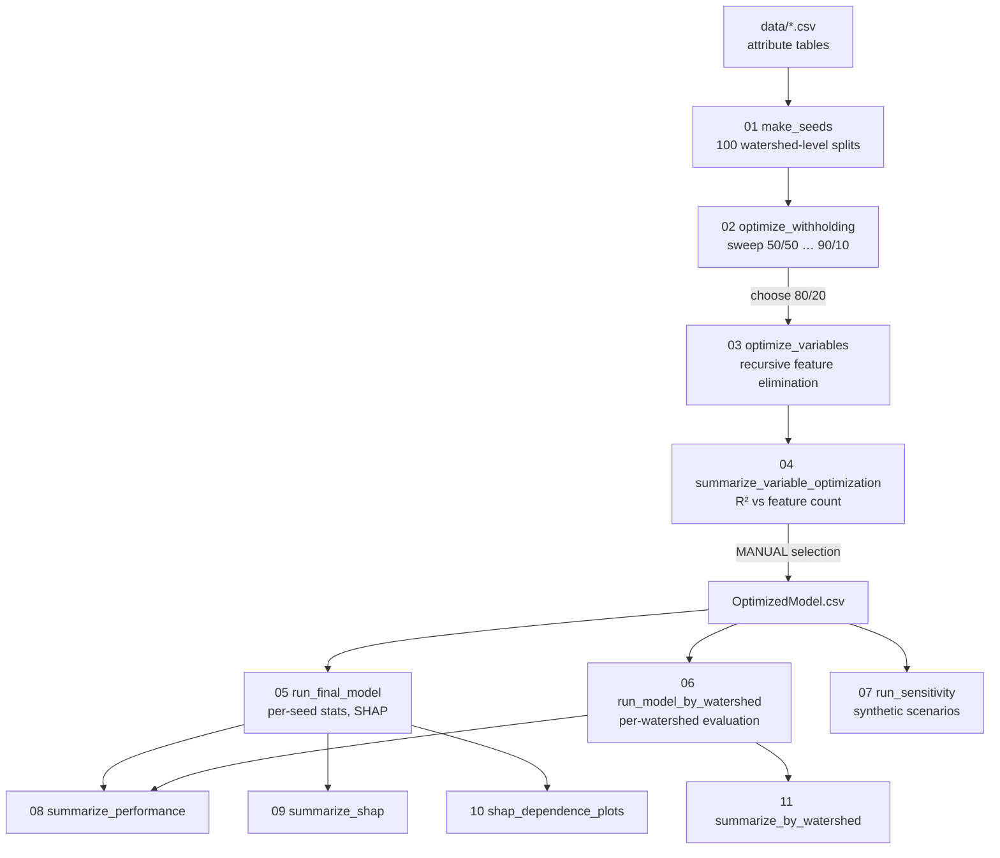

# postfire-peakflow-rf

Random-forest pipeline for modeling and interpreting post-fire peak streamflow drivers in western
U.S. watersheds — example code and workflow accompanying [Paper ID here once published].

## Setup

Run one of the following in the CLI of your choice:

**Conda (recommended):**

```bash
conda env create -f environment.yml
conda activate postfire-peakflow-rf
```

**pip / venv:**

```bash
python -m venv .venv
source .venv/bin/activate   # Windows: .venv\Scripts\activate
pip install -r requirements.txt
```

## The modelling task

This modelling task takes a large-sample data driven approach to answer the question of: given
characteristics of a burned watershed and storm that we can quantify, how large will the peak flow
be, and what characteristics drive that prediction?

We train a random forest regression model to help capture non-linear complex interactions. The
training data consists of one storm event at one watershed per row, with the target being the
storm's associated peak flow as measured at a gage. Peak flow is area normalized:

$$\text{PeakArea} = \frac{Q_{\text{peak}}}{A_{\text{basin}}} \quad [\text{m}^3/\text{s}/\text{km}^2]$$

The target is log transformed to improve model performance across a range of peak flow magnitudes,
as random forests minimize squared error. A consequence of this is predictions are in log space as
well, requiring exponentiation to back transform, and introducing a systematic low bias as a
geometric mean of PeakArea, not a conditional mean. Another important interpretation consequence
of the log transform is evaluation happens in log-space. Every R2, MSE, and RMSE produced here
describes log peak flow (e.g., an RMSE of 1.1 is a factor of ~3 in native units, m3/s/km2).

Every model is built with the same random number generator seed, and randomness lives in the 100
"seeds" (unique train/test splits). Producing models across "seeds" produces a distribution of R2
and SHAP values and aids in interpretation.

Splits are at the watershed level, such that every storm at a given gage lands on the same side of
the split, preventing leakage of storms at the same gage into the test set. Grouping by gage forces
the test watersheds to be entirely unseen, not just storms. Performance metrics therefore measure
spatial transferability, which matters for inference time, where predictions are generated for
watershed(s) unseen by the model.

This model has a stated domain of applicability, with dataset constraints informed by a separate
model, described in detail in: [Paper ID].

## Steps

The pipeline is broken into three phases. Steps 01-04 aid in choosing the design of the model. In
these steps you decide how to split the data and which features to keep for the final model. Steps
05-07 train the final models and generate predictions. Steps 08-11 turn per seed output into
figures and tables to interpret and evaluate the model.



### `01_make_seeds.py` - Build the train/test splits

This script generates 100 reusable watershed-level train/test splits, and every downstream step
evaluates against the same 100 unique configurations.

Let $W$ be the set of unique gages and $p$ the withholding fraction. The number of watersheds held
out for testing is:

$$n_{\text{test}} = \lfloor |W| \cdot p \rfloor$$

For each seed $x \in \{0, \dots, 99\}$, draw $T_x \subset W$ uniformly at random **without
replacement**, $|T_x| = n_{\text{test}}$, and set $R_x = W \setminus T_x$.

**Configuration:** change `WITHHOLD_FRACTION` and re-run the script for each withholding percentage
you want to compare in step 02. The output folder label is derived from the fraction automatically,
so the two can never disagree.

### `02_optimize_withholding.py` - Choose a train/test ratio

This script answers the question: how much data should be held out of the train set for testing?
Withhold too little and the test set is too small to measure performance with stability, and
withhold too much and the model is starved of training examples. For a set of withholding ratios,
and for each of 100 seeds: train a model, score it on the held-out watersheds, record R2, and then
compare the spread of R2 across withholding ratios.

### `03_optimize_variables.py` - Recursive feature elimination

This script aids in feature selection for the final model. We determine how model performance
changes as features are removed, and produce a ranking of feature importance.

For each seed, starting from the full feature set: train a model, record R2, MSE, RMSE and the full
importance ranking, identify the least important feature, remove it, and repeat this process until
one feature remains.

This step is computationally expensive and will take a long time to run.

### `04_summarize_variable_optimization.py` - Aggregate the elimination information into plots

This script aggregates step 03's output across all seeds into two things: an R2 versus feature
count curve, and an average feature importance ranking at each feature count.

Feature selection itself is a manual step. We read the R2 curve and choose the smallest feature
count that retains the performance, and may deliberately keep domain-critical variables that the
ranking alone would have dropped. The chosen set is saved by hand as the optimized attribute table
that step 05 reads.

### `05_run_final_model.py` - Train the final models

Train one forest per seed on the optimized feature set and produce all the data needed for the
interpretation steps: performance stats, test predictions, feature importances, diagnostic plots,
and SHAP values.

### `06_run_model_by_watershed.py` - Per watershed evaluation

Step 05 reports one R2 for a seed's entire test set. This step instead evaluates each test
watershed individually, so that we can look at what watersheds the model predicts well for, what it
fails on, and what drives predictions in a single watershed. For each seed, for each watershed $w$
in that seed's test set: train on the seed's training watersheds, test on $w$, and write stats,
predictions, importances, and SHAP.

### `07_run_sensitivity.py` - Synthetic scenario analysis

This step helps evaluate how specific drivers affect peak flow within a watershed of interest. We
build synthetic scenarios by sweeping one driver at a time while holding every other attribute at
its baseline value, then predict every scenario with all 100 trained models. The spread of
predictions across models shows how sensitive the modelled peak flow is to each driver.

### `08_summarize_performance.py` - Pooled performance figures

This is the main performance figure of the paper. Test predictions from every seed are pooled into
a single predicted versus actual plot, shaded by point density so the bulk of the data is visible
through the overplotting. For watersheds of interest, box plots are overlaid on top of the scatter
to show the spread of predictions the 100 models produce for each observed storm peak.

### `09_summarize_shap.py` - Global feature importance

This is the main importance figure of the paper. SHAP values from every seed are pooled, and each
feature is ranked by its mean absolute SHAP value, which measures how much a feature moves a
prediction regardless of direction. Bars are colored by feature category so the figure reads as
groups of drivers rather than a list of unrelated variables.

### `10_shap_dependence_plots.py` - Direction and shape of influence

Step 09 tells us how much each feature matters, and this step tells us how. For each feature we
plot its value against its SHAP value across all pooled storms, so both the direction of the effect
and the range over which it acts become visible. A rolling mean and percentile bands are drawn over
the raw points to make the trend readable.

### `11_summarize_by_watershed.py` - Per watershed driver profiles

Steps 09 and 10 ask what drives post-fire peaks across the whole dataset. This step asks what drives
them at a single gage, using the per-watershed SHAP values from step 06. The result is one influence
profile per watershed, along with a ranked table of the top drivers at each.

## A note on the data

The full training dataset is not distributed with this repository. The attribute tables in `data/`
are examples that illustrate the format of the input and let the pipeline run end to end. Running
this code will not reproduce the numbers in the paper.

Outputs are written to `outputs/`, which each script creates as needed and is excluded from
version control.

